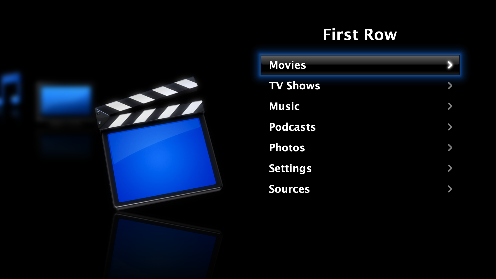
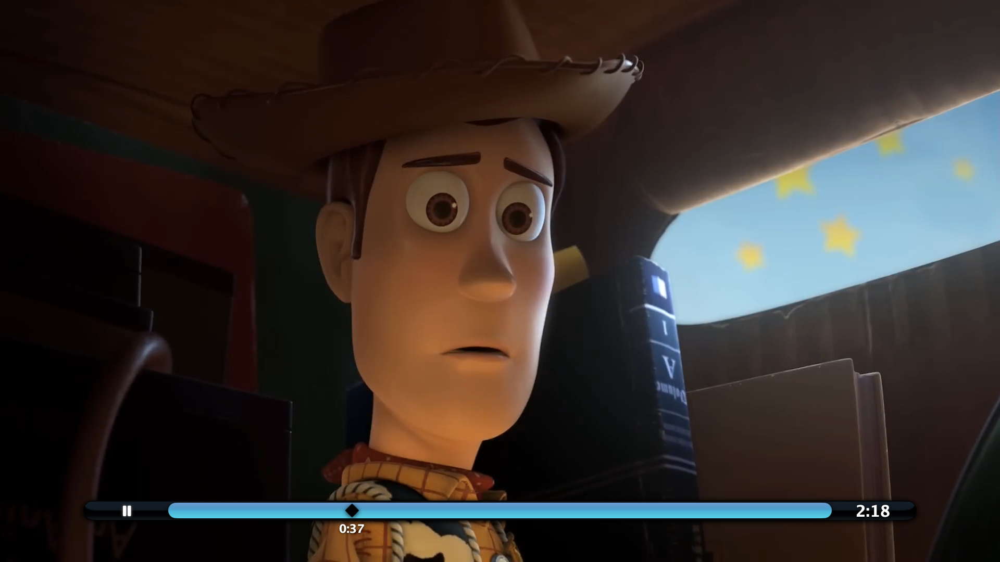
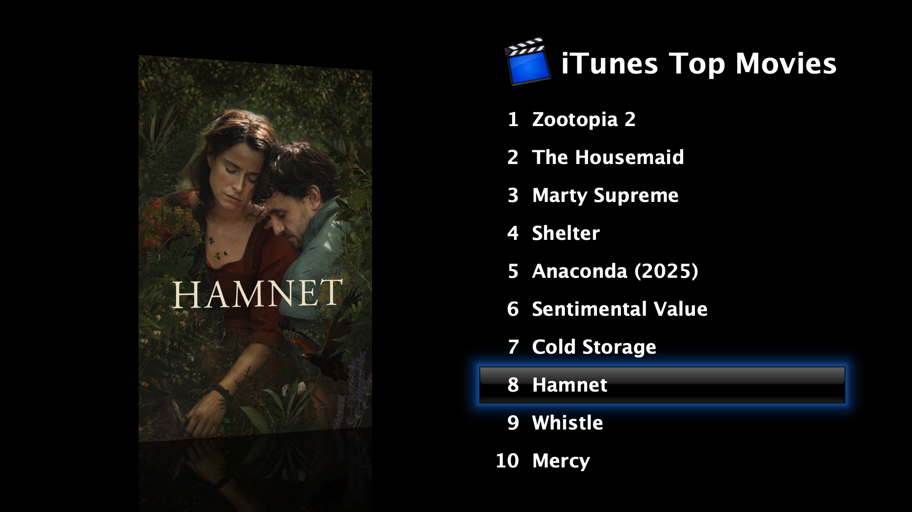
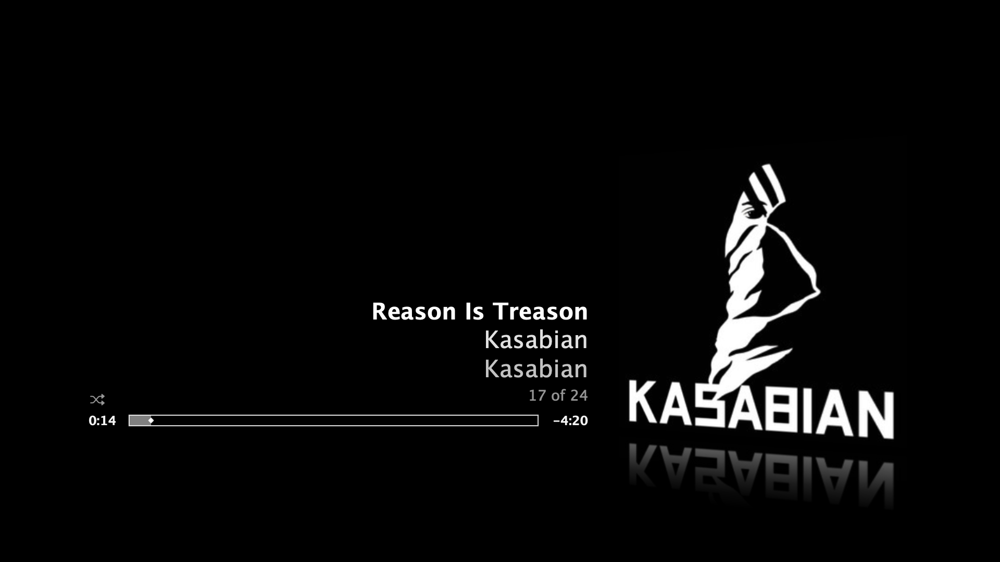
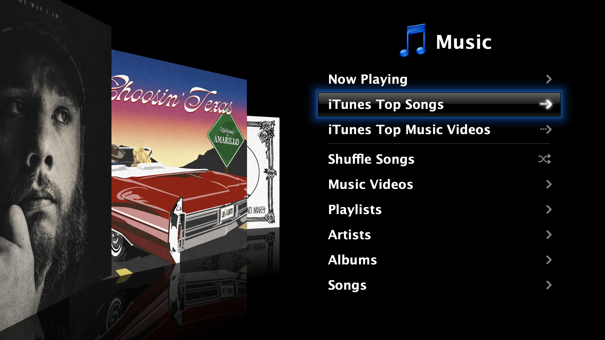
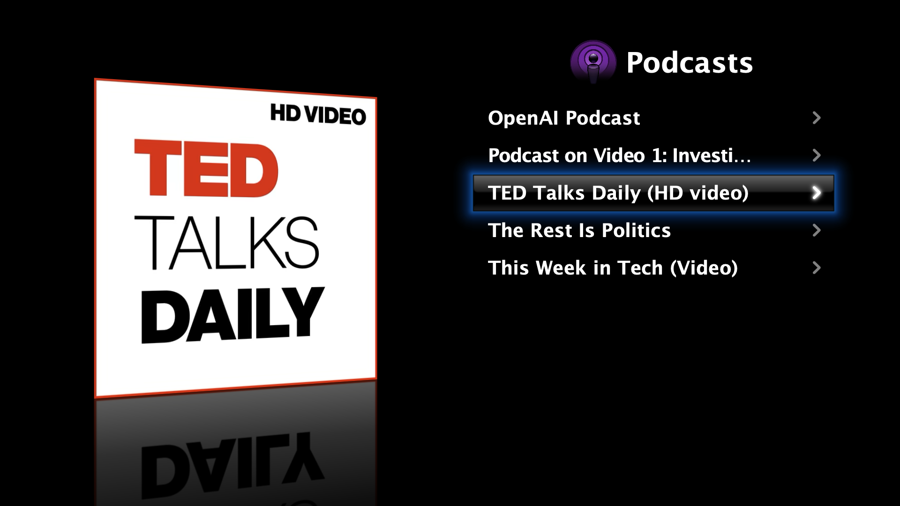
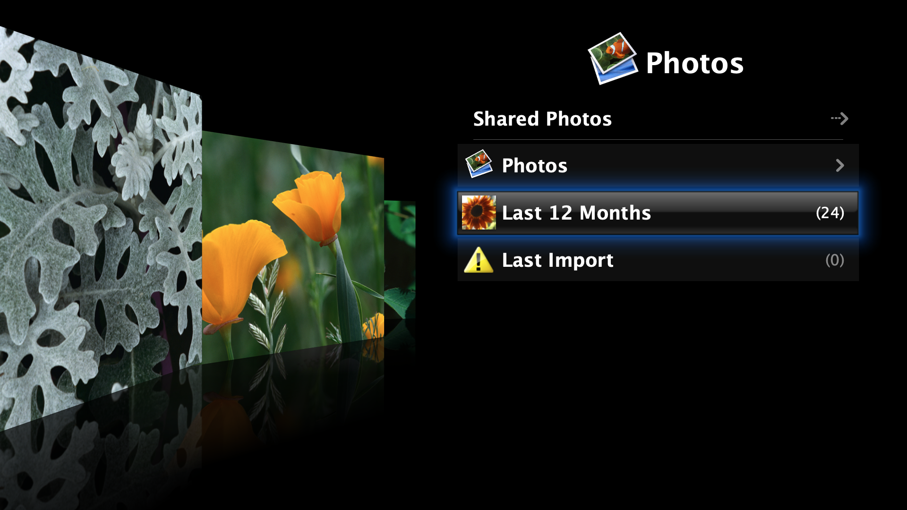

# First Row


https://github.com/user-attachments/assets/2ff954c0-50fe-403b-b0b7-39557c937d62


A SwiftUI recreation of Apple's **Front Row**, the beautiful media frontend that shipped in Mac OS X Tiger through Snow Leopard. Front Row allowed users to navigate their media with an eye-catching and slick UI, and gave Mac users a living-room worthy experience that also featured in the first-generation Apple TV.

This project brings it back. The full menu system, animations, transitions, and overall experience are all faithfully recreated in modern Swift and SwiftUI, running on macOS 11.5+, and experimentally: iOS 15.6+, iPadOS 15.6+, tvOS 15.6+ (with limitations), and visionOS 1.0+.

Here, the Leopard/Snow Leopard version of the interface is used as a reference.

## Features

- Beautiful and authentic interface, with animations and UI elements tuned obsessively to pixel-precision for an accurate recreation of the original Front Row interface
- Features a meticulous recreation of Front Row's 3D icon carousel on the main menu
- Highly accurate recreations of key components like 3D artwork carousels that characterised the beauty of the original UI
- Music playback (Apple Music + local library) with a fantastic view of cover art and small details (like the player flipping around for burn-in protection)
- Photo slideshows (Apple Photos library) with background music from your library and a Ken Burns Effect
- Local movie playback from macOS Movies folder (or iOS/iPadOS/visionOS file system) via AVKit
- Podcast viewing/listening on macOS if podcasts are downloaded on the device via Apple Podcasts
- iTunes Top Charts and playable previews (movies, TV episodes, songs, music videos) via the iTunes RSS feeds
- Screen saver with gorgeous floating photos 
- Keyboard, touch, and game controller driven navigation (Siri Remotes are supported on tvOS)

Playback of movies and TV shows originating from the Apple TV app is not supported due to DRM-protection, but local video content from elsewhere can be played.

## Images

<p align="center">
  
  
  
</p>

<p align="center">
  
  
  
</p>

<p align="center">
  
</p>

## Controls

- `Keyboard`: Arrow keys navigate/allow scrubbing media, `Enter` selects, `Delete`/`Backspace` goes back, `Space` toggles playback in fullscreen media views.
- `Siri Remote (tvOS)`: Directional pad or swipe gestures navigate/scrub, `Select` chooses, `Menu` goes back, `Play/Pause` toggles playback.
- `Game controller`: D-pad or left stick navigates/scrubs, `A` selects, `B` or `Menu` goes back, `X` toggles playback.
- `Touch (iOS/iPadOS)`: Tap screen quadrants to navigate/scrub, press and hold to repeat navigation, two-finger tap selects, three-finger tap goes back, four-finger tap toggles playback.
- `Fullscreen media player`: `Up`/`Down` switches songs or podcast episodes, `Left`/`Right` scrubs through the current item.

## Project structure

```
firstrow/
├── AppShell.swift                     App entry point
├── MenuView.swift                     Core state container (all @State/@AppStorage/let)
├── MenuView+*.swift                   Domain extensions (navigation, rendering, input..., internal reusable components)
├── MenuFeatures.swift                 MenuFeatureConfiguration protocol + typealiases
├── MenuConfiguration.swift            Feature registry - add new features here
├── MenuCatalog.swift                  Structures to represent menu/submenu items and their actions
├── MenuModels.swift                   RootMenuItemConfig, SubmenuItemConfig, etc.
├── MenuInput.swift                    KeyCode and input model types
├── SharedCacheTypes.swift             Cache utility types
├── PlatformCompatibility.swift        Cross-platform shims
├── PlaybackTimeFormatting.swift       Shared time formatting
├── SoundEffectPlayer.swift            AVAudioPlayer wrapper
├── ReflectedGapContentIconView.swift  Fallback icon view for left side of the interface
├── FullscreenSceneSupport.swift       FullscreenScenePresentation type + builder alias
├── FeatureErrorFullscreenView.swift   Shared error fullscreen
├── TVRemoteInputOverlay.swift         Siri Remote input handling
├── TouchNavigationInputOverlay.swift  Experimental touch input handling
│
├── Movies.frappliance/                Movies + iTunes Top playback
├── TV.frappliance/                    A menu to access iTunes Top TV Episodes
├── Music.frappliance/                 Music library, playback, and Now Playing UI
├── Podcasts.frappliance/              Podcast series and episode browsing
├── Photos.frappliance/                Photo library browsing and slideshows
├── FRSettings.frappliance/            Settings screen + screen saver
├── FRSources.frappliance/             Sources screen + Connect to iTunes
│
├── Assets.xcassets/                   All image assets
├── Sounds/                            Sound effects (.aif) and slideshow default music (.mp3)
├── Videos/                            Intro movie (.mov)
└── ScreenSaverDefaultPhotos/          Bundled photos for the screen saver (this will be updated to pull from real albums)
```

Each `.frappliance` folder is broadly intended to be a plugin, where each media domain (Movies, Music, Photos…) is a separately loadable `.frappliance` bundle.

---

## Adding a new frappliance

Adding a new top-level menu option (e.g. **NewTube**) takes five steps.

### 1. Create the frappliance folder

```
NewTube.frappliance/
```

### 2. Create the feature struct

Create `NewTube.frappliance/NewTubeFeature.swift`:

```swift
import Foundation

struct NewTubeFeature: MenuFeatureConfiguration {
    let rootItem = RootMenuItemConfig(id: "newtube", title: "NewTube", iconAssetName: "newtube")
    let submenuItems: [SubmenuItemConfig] = [
        .init(id: "newtube_playlists", title: "Playlists", leadsToMenu: true),
        .init(id: "newtube_videos",    title: "Videos",       leadsToMenu: true),
    ]
}
```

- **`rootItem.id`** — unique snake_case identifier for the root entry.
- **`iconAssetName`** — name of the image in `Assets.xcassets` shown when this root item is selected (see step 3).
- **`submenuItems`** — the list shown when the user enters the menu. Set `leadsToMenu: true` if selecting the item drills deeper; leave it `false` for leaf actions.
- **`defaultSubmenuSelectedIndex`** — optionally override to start the submenu cursor on a specific row (defaults to 0).

### 3. Add the icon image for the main carousel

Add `newtube.png` as an image set in `Assets.xcassets`:

```
Assets.xcassets/
└── newtube.imageset/
    ├── newtube.png
    └── Contents.json
```

`Contents.json`:
```json
{
  "images" : [
    {
      "filename" : "newtube.png",
      "idiom" : "universal"
    }
  ],
  "info" : {
    "author" : "xcode",
    "version" : 1
  }
}
```

### 4. Register the feature

Open `MenuConfiguration.swift` and add the new feature to the catalog:

```swift
private static let catalog = MenuCatalog(features: [
    MoviesMenuFeature(),
    TVShowsMenuFeature(),
    MusicMenuFeature(),
    PodcastsMenuFeature(),
    PhotosMenuFeature(),
    SettingsMenuFeature(),
    SourcesMenuFeature(),
    NewTubeMenuFeature(),   // ← add here
])
```

Order in this array is the order items appear in the root menu.

At this point the menu item appears, navigates in and out, and plays the correct sound effects. The submenu shows the rows you defined, but selecting them does nothing yet.

### 5. Handle submenu actions

Open `MenuView+InputHandling.swift` and find `triggerSubmenuAction()`. Add a handler for each interactive submenu item:

```swift
if activeRootItemID == "newtube", item.id == "newtube_playlists" {
    playSound(named: "Selection")
    // e.g. enter a third menu, present another fullscreen view, etc.
    enterNewTubePlaylistsMenu()
    return
}
```

Any submenu item whose action is not handled here will print a `TODO` log line.

---

### Gap content (left-side preview)

The left half of the screen shows contextual content while the user scrolls through the menu. To add gap content for your feature, open `MenuView+GapContent.swift` and extend `gapContentView(for:sceneSize:)` with a new branch.

The simplest option is the default reflected menu icon (already shown automatically from `iconAssetName`). For richer previews, artwork carousels, video thumbnails, etc., follow the pattern in `Movies.frappliance/MoviePreviewGapContentView.swift` or `Music.frappliance/MusicTopLevelCarouselGapContentView.swift`.

### Optional: submenus of menu options ("third" menus)

Add a case to `ThirdMenuMode` in `MenuView+MenuNavigation.swift`:

```swift
enum ThirdMenuMode {
    // …existing cases…
    case newtubePlaylists
}
```

Then populate `thirdMenuItems` and set `thirdMenuMode = .newtubePlaylists` when the user enters that submenu item. Follow `enterMoviesFolderMenu()` in `Movies.frappliance/MenuView+MoviesLibrary.swift` as a reference.

## Thanks

If you'd like to support the project, you can [buy me a coffee](https://buymeacoffee.com/gameroof1w).

## License

Creative Commons Attribution 4.0: [https://creativecommons.org/licenses/by/4.0/](https://creativecommons.org/licenses/by/4.0/)
